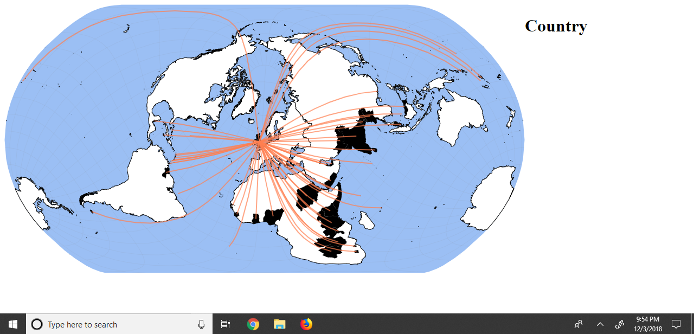
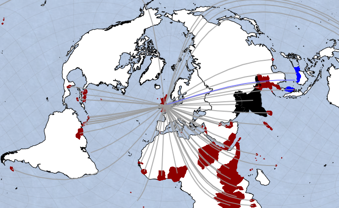
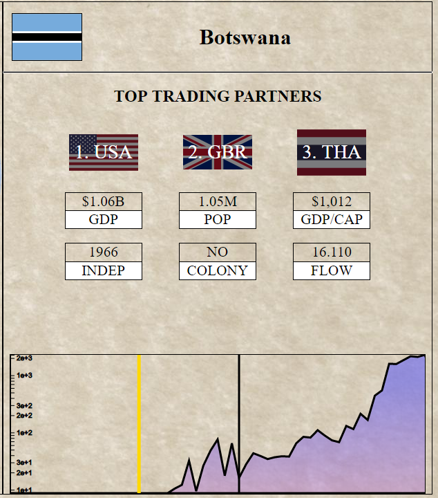
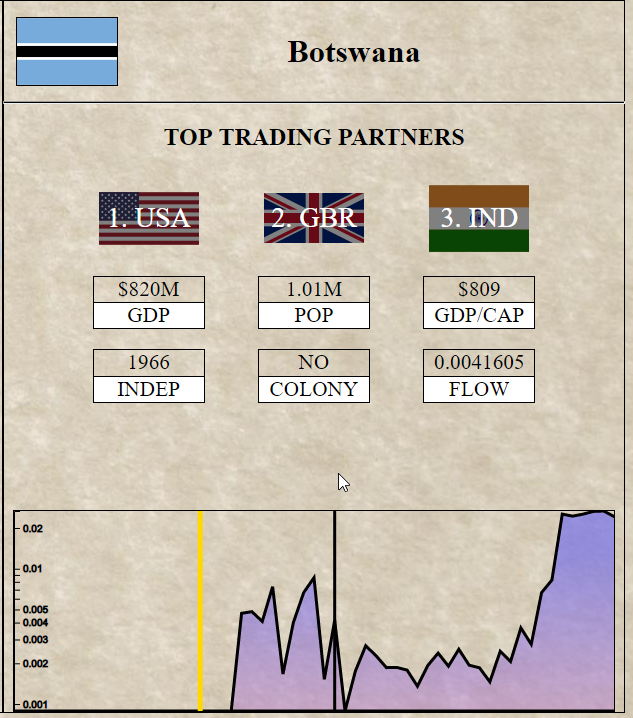

# Visualizing Independence
# Process Book

Project title: Visualizing Independence

Name: Christopher Kinsey

Email: toph.kinsey@gmail.com

A#: 01784086

Repository: https://github.com/tophski/gb-trade-vis

## Background and Motivation

I found this dataset while browsing the project resources. I was very interested in the paper published using the data, but there were no interesting visualizations associated with it. The data and paper describe how countries' trade relationships changed during colonization and after independence. I will focus particularly on Great Britain for this. I have always been fascinated by the economies of large empires, and 20th century Great Britain had the largest empire the world has ever seen, and there is plenty of data on it.

## Project Objectives

The visualizations will describe how former British colonies were affected economically by being colonized and gaining their independence. Naturally, different countries will be affected in different ways by these events, so I will provide a way to view specific relationships in greater detail. 

I want to have a general answer to the question, "How do former colonies, once decolonized, evolve economically with respect to their former governing empires?" Of course, the answers to this question vary wildly from country to country, so there can be no one satisfying answer, but a good visualization can at least give you leads on all the unique stories of independence.

## Data

The primary dataset I will be using is hosted at http://econ.sciences-po.fr/thierry-mayer/data. More was drawn from other sources, and that is covered in the checkpoint section.

## Data Processing

The provided datasets have statistics covering every pair of countries 1948 - 2006. Much of this data will be irrelevant to my project, so I will filter out data covering countries that are not related to the British Empire. Most of the statistics required for the visualizations should already be present, but I may need to derive a simpler metric to describe trade relationships.

## Visualization Design

## Must-Have Features

### Map
- Azimuthal projection map filtered to only fully draw major colonies and former colonies within continents.
- Weighted Arrows connecting countries with GB.
- Big timeline on map to select year.
- Click to select countries

### Detail Panel
- Country name and flag
- 3-letter iso country code for 3 main trading partners with darkened flag behind, change by year.
- Linked year slider, shaded to show relationship to GB. Dark red for trade deficit, white for neutral, dark blue for trade surplus.
- Population, GDP, colony status, etc. according to year.
- Non-year specific info. Dates colonized and freed, type of separation, etc.

## Optional Featuers
- Change arrows to show full trade data for selected country, and filter out others.
- Additional color coding on the big map timeline, showing relative 'strength' of the British Empire.

## Project Schedule

I will be setting my due dates on Thursdays for my own convinience.

Nov 8: Have the dataset completely cleaned, processed, and imported into D3 in a suitable format.

Nov 15: Draw the map, showing Great Britian, its colonies, and lines linking them with some indication of trade strength. Animate the map over the time series.

Nov 22: Make the map interactive, showing details of the selected country's relationship with Great Britain over time.

Nov 29: Clean everything up, make sure everything is presentable, and submit the project.

# Checkpoint

## Exploring Data

The dataset has 37 columns for each data point, containing information such as population, whether or not two countries share a common legal system, the distance between the countries, and more. The column headers for the data are not very descriptive, and the paper that accompanies the data does not do a very good job of documenting what the headers mean. Because of this, I've spent most of my time trying to interpret the dataset. 

I still don't know exactly what the trade flow variable is, though I do know its the variable I'm interested in. It seems to be a ratio of the trade between two countries normalized against that of two arbitrary countries. I don't think the paper explicitly says which version of this variable they saved to the public dataset, but whatever it is, it will work for this visualization.

## Processing

Processing the data is as simple as writing a few Python utilities to extract the data from its normal .dta format, filter it according to the contries involved, and saving it to .csv format. These utilities are in ./python_wranglotron/wranglotron.py.

## Design Evolution

I've decided to not use an Azimutal projection. I think that the idea of the circular world with Great Britain at the center told the story very well, but the edge distortion turned out to be a problem. Azimuthal Projections have more distortion away from the center, and Inida, one of the biggest colonial stories of Great Britain, is almost on the opposite side of the world, so it turns out extremely distorted. Right now, I'm using the Natural Earth projection rotated to be cnetered on Great Britain. This has less distortion, though it does give Africa a questionable shape.

There are more colonies than I expected, including some (such as the United States and Canada) that gained independence well before the scope of the dataset. I filter most of these out, but there were still enough that adding coding to the arc paths in the map seemed like it would make the final product look too cluttered.

## Additional Data

I needed a list of country centroids to draw arcs from colonies to Great Britain. I found this in CSV format at http://worldmap.harvard.edu/data/geonode:country_centroids_az8.

The main dataset identified countries with ISO country codes. I downloaded a csv file to lookup full country names and 2-letter country codes from the ISO at https://github.com/lukes/ISO-3166-Countries-with-Regional-Codes.

I needed small images of the flags of each country. I found them at https://github.com/hjnilsson/country-flags.

# Final Design

## Map

Since the idea of coding information into the trade arcs did not pan out, I wanted to add something else to the map to make it more interactive, and give it a story of its own. I decided to color each country according to whether or not it is a colony in the current year. I chose dark red with a thick outline for current colonies. This has the added benefit of helping the small island countries stand out from the ocean.

## Data

The dataset was spectacularly hard to understand with only the paper as a guide. Initally from the description I thought the data would be data on trade gravity, a theory that says it is possible to predict countries' trading flows based on their GDPs and distances. This was not the case, though trade gravity theory is addressed in the paper. 

Next, I thought that I would just compare the imports of each country from Great Britain to its exports to Great Britain and compare the trade surplus / deficits across time. This did work with the dataset, but it is not what was addressed in the paper and the stories that could be drawn from it did not seem very interesting.

Next, I simply added the imports and exports together to get a bilateral trade flow. This showed the strength of the countries' trade relationship with Great Britain across time, but the story here was misleading. The paper demonstrated how countries' trade relationships with their colonizers deteriorated after independence, but all my charts were showing a steady increase in trade over time. I realized that this was happening because of a general increase in wealth of the countries, not because of a real change in trade patterns.

Finally, I used the method in the paper of normalizing the bilateral trade flow of a given year against a pair of reference countries, in this case France and Great Britain. This means simply dividing the bilateral trade flow of any pair of countries against that of France and Great Britain. Since this is a fairly stable trade relationship (in this dataset at least, which does not cover the Brexit event) it serves to put the trade patterns of other countries in proper context for a given year.

## Implementation

I made my visualization to give the maximum amount of data with few controls and minimal clutter. I wanted to see how countries developed their own trade relationships after independence, and that is done in several ways:

1. The main map shows which countries are colonized in the selected year. As you slide the year forward, you can watch countries tick off the map as they gain their independence. In 1948, Great Britain is still recognizably the largest empire in world history, shown by vast swathes of red territory and red dots thoughout the world's oceans. By 2006, only a few islands remain as nominal territories of the UK.

2. The trade flow graph is an excellent tool to see at a glance what the trade history of a country looks like with Great Britain. A yellow line is added into the chart to highlight the year that country gained independence, so you can see at a glance when the country gained autonomy, and how it reacted economically to self-governance. 

3. The top trading partners in of the details panel adds a wealth of global context to the story of independence without introducing the mind-numbing details of digging through numbers. At a glance, you can see who a country is trading with in a given year. As you leave one country selected and slide through the time series, you can see Great Britain fall from first place, usually around the time of independence. From there, no two stories are the same. Many Pacific islands see their neighbors rise to peak importance. Some African countries drift away from European trade and then return to it toward the new millennium. Many other country fall within the spheres of influence of either the US or China, but rarely both. 

## Evaluation

My biggest problem with my own design is probably the timeline in this. I decided to use a boxed d3 slider for simplicity. When I added it in, I thought, "I'll just come back and style this later." Unfortunately, it is a very simple slider, and not terribly friendly to styling. Probably the most obvious fault of the visualization is the inability to select the date by clicking on the chart. This is a glaring issue, but I simply ran out of time. 

I'd like to have a better way of showing the trade arcs, or at least have them do something interesting, but whenever I experimented with that I felt like I was just adding useless information and cluttering a very pretty map with things I didn't care to see. I was tempted to get rid of them, but that removes some of the centrality of Great Britain and makes it very difficult to locate some of the tiny Pacific islands.

I would like to add functionality to dig further into each country's later trade patterns without putting Great Britain at the center, but I know that if I was handed such a tool I would spend months in the rabbit hole. Part of the charm of this visualization is its simplicity and focus, and that wouldn't be possible without such a limited scope. I think it would be fascinating to switch the focus over to France and its former colonies in a riff on this project. That wouldn't take too much work either, just refactoring "GBR" to "FRA" across many different files.

There is no one story of a country gaining its independence. People in the United States grow up hearing stories of George Washington and the founding fathers, and there are many other equally colorful stories hidden away around the world. This visualization does not tell those stories the way they should be told, but it can be mined for threads to pull on by searching the internet that lead to the stories that create national identities.
